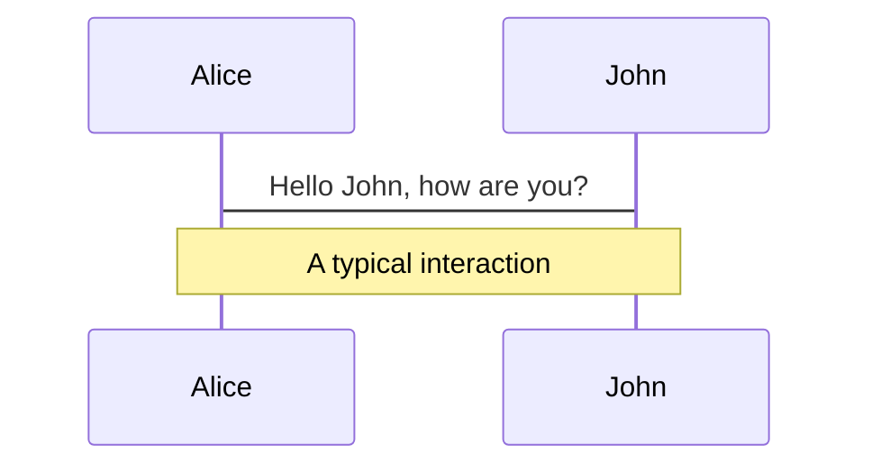
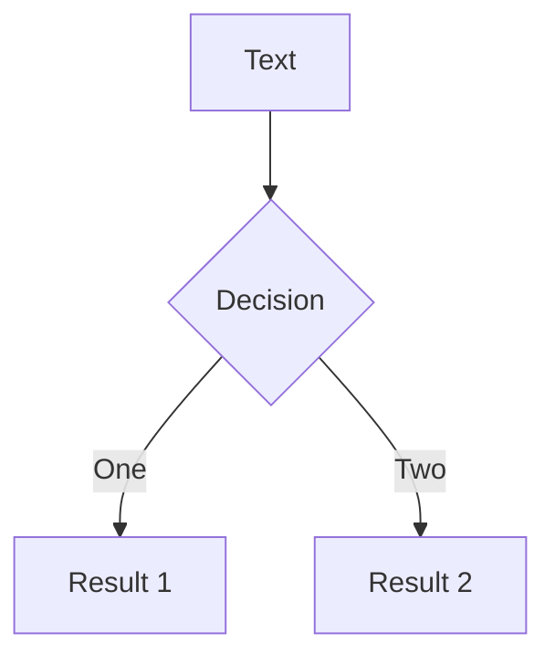
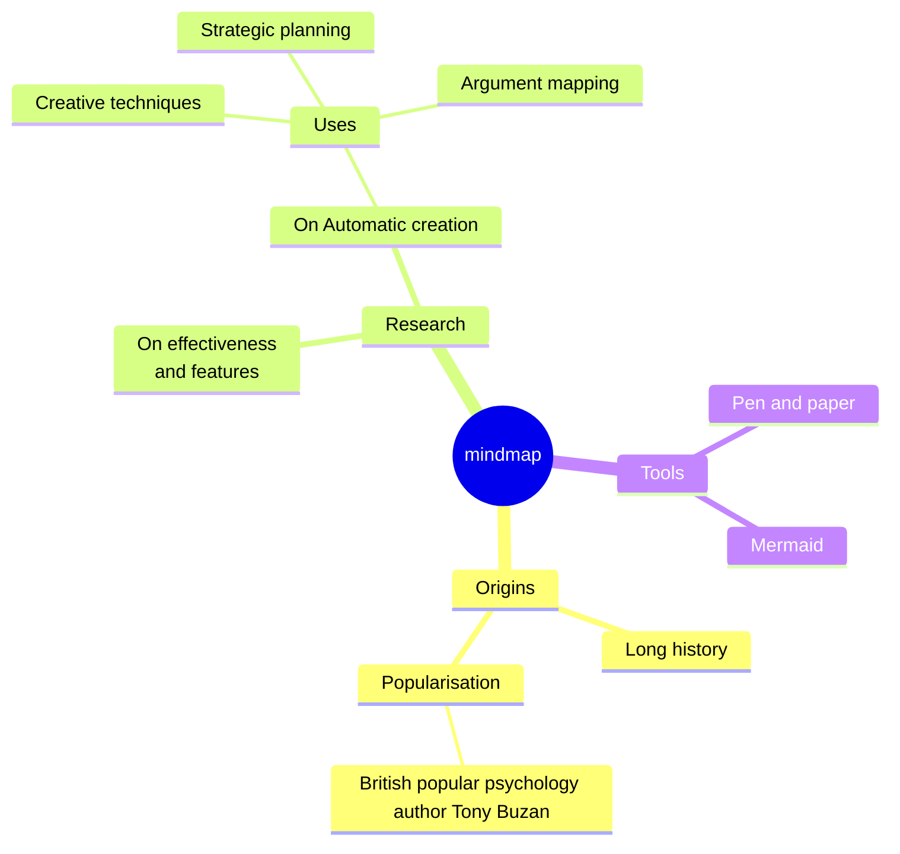
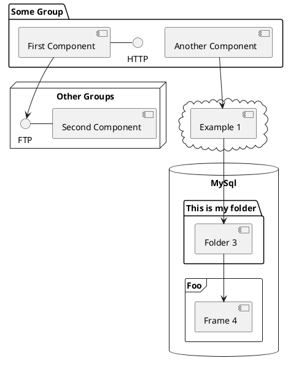

---
# You can also start simply with 'default'
theme: seriph
infoLine: true
author: Ao Fu
# random image from a curated Unsplash collection by Anthony
# like them? see https://unsplash.com/collections/94734566/slidev
background: https://cover.sli.dev
# some information about your slides (markdown enabled)
title: Welcome to Slidev
info: |
  ## Slidev Starter Template
  Presentation slides for developers.

  Learn more at [Sli.dev](https://sli.dev)
# apply unocss classes to the current slide
class: text-center
# https://sli.dev/features/drawing
drawings:
  persist: false
# slide transition: https://sli.dev/guide/animations.html#slide-transitions
transition: slide-left
# enable MDC Syntax: https://sli.dev/features/mdc
mdc: true
---

# Welcome to Slidev

Presentation slides for developers

<div @click="$slidev.nav.next" class="mt-12 py-1" hover:bg="white op-10">
  Press Space for next page <carbon:arrow-right />
</div>

<div class="abs-br m-6 text-xl">
  <button @click="$slidev.nav.openInEditor" title="Open in Editor" class="slidev-icon-btn">
    <carbon:edit />
  </button>
  <a href="https://github.com/slidevjs/slidev" target="_blank" class="slidev-icon-btn">
    <carbon:logo-github />
  </a>
</div>

<!--
The last comment block of each slide will be treated as slide notes. It will be visible and editable in Presenter Mode along with the slide. [Read more in the docs](https://sli.dev/guide/syntax.html#notes)
-->

---
transition: fade-out
---

# What is Slidev?

Slidev is a slides maker and presenter designed for developers, consist of the following features

- 📝 **Text-based** - focus on the content with Markdown, and then style them later
- 🎨 **Themable** - themes can be shared and re-used as npm packages
- 🧑‍💻 **Developer Friendly** - code highlighting, live coding with autocompletion
- 🤹 **Interactive** - embed Vue components to enhance your expressions
- 🎥 **Recording** - built-in recording and camera view
- 📤 **Portable** - export to PDF, PPTX, PNGs, or even a hostable SPA
- 🛠 **Hackable** - virtually anything that's possible on a webpage is possible in Slidev
<br>
<br>

Read more about [Why Slidev?](https://sli.dev/guide/why)

<!--
You can have `style` tag in markdown to override the style for the current page.
Learn more: https://sli.dev/features/slide-scope-style
-->

<style>
h1 {
  background-color: #2B90B6;
  background-image: linear-gradient(45deg, #4EC5D4 10%, #146b8c 20%);
  background-size: 100%;
  -webkit-background-clip: text;
  -moz-background-clip: text;
  -webkit-text-fill-color: transparent;
  -moz-text-fill-color: transparent;
}
</style>

<!--
Here is another comment.
-->

---
transition: slide-up
level: 2
---

# Navigation

Hover on the bottom-left corner to see the navigation's controls panel, [learn more](https://sli.dev/guide/ui#navigation-bar)

## Keyboard Shortcuts

|                                                     |                             |
| --------------------------------------------------- | --------------------------- |
| <kbd>right</kbd> / <kbd>space</kbd>                 | next animation or slide     |
| <kbd>left</kbd>  / <kbd>shift</kbd><kbd>space</kbd> | previous animation or slide |
| <kbd>up</kbd>                                       | previous slide              |
| <kbd>down</kbd>                                     | next slide                  |

<!-- https://sli.dev/guide/animations.html#click-animation -->

<p v-after class="absolute bottom-23 left-45 opacity-30 transform -rotate-10">Here!</p>

---
layout: two-cols
layoutClass: gap-16
---

# Table of contents

You can use the `Toc` component to generate a table of contents for your slides:

```html
<Toc minDepth="1" maxDepth="1" />
```

The title will be inferred from your slide content, or you can override it with `title` and `level` in your frontmatter.

::right::

<Toc text-sm minDepth="1" maxDepth="2" />

---
layout: image-right
image: https://cover.sli.dev
---

# Code

Use code snippets and get the highlighting directly, and even types hover!

```ts {all|5|7|7-8|10|all} twoslash
// TwoSlash enables TypeScript hover information
// and errors in markdown code blocks
// More at https://shiki.style/packages/twoslash

import { computed, ref } from 'vue'

const count = ref(0)
const doubled = computed(() => count.value * 2)

doubled.value = 2
```

<arrow v-click="[4, 5]" x1="350" y1="310" x2="195" y2="334" color="#953" width="2" arrowSize="1" />

<!-- This allow you to embed external code blocks -->
<<< @/snippets/external.ts#snippet

<!-- Footer -->

[Learn more](https://sli.dev/features/line-highlighting)

<!-- Inline style -->
<style>
.footnotes-sep {
  @apply mt-5 opacity-10;
}
.footnotes {
  @apply text-sm opacity-75;
}
.footnote-backref {
  display: none;
}
</style>

<!--
Notes can also sync with clicks

[click] This will be highlighted after the first click

[click] Highlighted with `count = ref(0)`

[click:3] Last click (skip two clicks)
-->

---
level: 2
---

# Shiki Magic Move

Powered by [shiki-magic-move](https://shiki-magic-move.netlify.app/), Slidev supports animations across multiple code snippets.

Add multiple code blocks and wrap them with <code>````md magic-move</code> (four backticks) to enable the magic move. For example:

````md magic-move {lines: true}
```ts {*|2|*}
// step 1
const author = reactive({
  name: 'John Doe',
  books: [
    'Vue 2 - Advanced Guide',
    'Vue 3 - Basic Guide',
    'Vue 4 - The Mystery'
  ]
})
```

```ts {*|1-2|3-4|3-4,8}
// step 2
export default {
  data() {
    return {
      author: {
        name: 'John Doe',
        books: [
          'Vue 2 - Advanced Guide',
          'Vue 3 - Basic Guide',
          'Vue 4 - The Mystery'
        ]
      }
    }
  }
}
```

```ts
// step 3
export default {
  data: () => ({
    author: {
      name: 'John Doe',
      books: [
        'Vue 2 - Advanced Guide',
        'Vue 3 - Basic Guide',
        'Vue 4 - The Mystery'
      ]
    }
  })
}
```

Non-code blocks are ignored.

```vue
<!-- step 4 -->
<script setup>
const author = {
  name: 'John Doe',
  books: [
    'Vue 2 - Advanced Guide',
    'Vue 3 - Basic Guide',
    'Vue 4 - The Mystery'
  ]
}
</script>
```
````

---

# Components

<div grid="~ cols-2 gap-4">
<div>

You can use Vue components directly inside your slides.

We have provided a few built-in components like `<Tweet/>` and `<Youtube/>` that you can use directly. And adding your custom components is also super easy.

```html
<Counter :count="10" />
```

<!-- ./components/Counter.vue -->
<Counter :count="10" m="t-4" />

Check out [the guides](https://sli.dev/builtin/components.html) for more.

</div>
<div>

```html
<Tweet id="1390115482657726468" />
```

<Tweet id="1390115482657726468" scale="0.65" />

</div>
</div>

<!--
Presenter note with **bold**, *italic*, and ~~striked~~ text.

Also, HTML elements are valid:
<div class="flex w-full">
  <span style="flex-grow: 1;">Left content</span>
  <span>Right content</span>
</div>
-->

---
class: px-20
---

# Themes

Slidev comes with powerful theming support. Themes can provide styles, layouts, components, or even configurations for tools. Switching between themes by just **one edit** in your frontmatter:

<div grid="~ cols-2 gap-2" m="t-2">

```yaml
---
theme: default
---
```

```yaml
---
theme: seriph
---
```


</div>

Read more about [How to use a theme](https://sli.dev/guide/theme-addon#use-theme) and
check out the [Awesome Themes Gallery](https://sli.dev/resources/theme-gallery).

---

# Clicks Animations

You can add `v-click` to elements to add a click animation.

<div v-click>

This shows up when you click the slide:

```html
<div v-click>This shows up when you click the slide.</div>
```

</div>

<br>

<v-click>

The <span v-mark.red="3"><code>v-mark</code> directive</span>
also allows you to add
<span v-mark.circle.orange="4">inline marks</span>
, powered by [Rough Notation](https://roughnotation.com/):

```html
<span v-mark.underline.orange>inline markers</span>
```

</v-click>

<div mt-20 v-click>

[Learn more](https://sli.dev/guide/animations#click-animation)

</div>

---

# Motions

Motion animations are powered by [@vueuse/motion](https://motion.vueuse.org/), triggered by `v-motion` directive.

```html
<div
  v-motion
  :initial="{ x: -80 }"
  :enter="{ x: 0 }"
  :click-3="{ x: 80 }"
  :leave="{ x: 1000 }"
>
  Slidev
</div>
```

<div class="w-60 relative">
  <div class="relative w-40 h-40">
    
    
    
  </div>

  <div
    class="text-5xl absolute top-14 left-40 text-[#2B90B6] -z-1"
    v-motion
    :initial="{ x: -80, opacity: 0}"
    :enter="{ x: 0, opacity: 1, transition: { delay: 2000, duration: 1000 } }">
    Slidev
  </div>
</div>

<!-- vue script setup scripts can be directly used in markdown, and will only affects current page -->
<script setup lang="ts">
const final = {
  x: 0,
  y: 0,
  rotate: 0,
  scale: 1,
  transition: {
    type: 'spring',
    damping: 10,
    stiffness: 20,
    mass: 2
  }
}
</script>

<div
  v-motion
  :initial="{ x:35, y: 30, opacity: 0}"
  :enter="{ y: 0, opacity: 1, transition: { delay: 3500 } }">

[Learn more](https://sli.dev/guide/animations.html#motion)

</div>

---

# LaTeX

LaTeX is supported out-of-box. Powered by [KaTeX](https://katex.org/).

<div h-3 />

Inline $\sqrt{3x-1}+(1+x)^2$

Block
$$ {1|3|all}
\begin{aligned}
\nabla \cdot \vec{E} &= \frac{\rho}{\varepsilon_0} \\
\nabla \cdot \vec{B} &= 0 \\
\nabla \times \vec{E} &= -\frac{\partial\vec{B}}{\partial t} \\
\nabla \times \vec{B} &= \mu_0\vec{J} + \mu_0\varepsilon_0\frac{\partial\vec{E}}{\partial t}
\end{aligned}
$$

[Learn more](https://sli.dev/features/latex)

---

# Diagrams

You can create diagrams / graphs from textual descriptions, directly in your Markdown.

<div class="grid grid-cols-4 gap-5 pt-4 -mb-6">









</div>

Learn more: [Mermaid Diagrams](https://sli.dev/features/mermaid) and [PlantUML Diagrams](https://sli.dev/features/plantuml)

---
foo: bar
dragPos:
  square: 674,30,167,_,-16
---

# Draggable Elements

Double-click on the draggable elements to edit their positions.

<br>

###### Directive Usage

```md

```

<br>

###### Component Usage

```md
<v-drag text-3xl>
  <div class="i-carbon:arrow-up" />
  Use the `v-drag` component to have a draggable container!
</v-drag>
```

<v-drag pos="663,206,261,_,-15">
  <div text-center text-3xl border border-main rounded>
    Double-click me!
  </div>
</v-drag>


###### Draggable Arrow

```md
<v-drag-arrow two-way />
```

<v-drag-arrow pos="67,452,253,46" two-way op70 />

---
src: ./pages/imported-slides.md
hide: false
---

---

# Monaco Editor

Slidev provides built-in Monaco Editor support.

Add `{monaco}` to the code block to turn it into an editor:

```ts {monaco}
import { ref } from 'vue'
import { emptyArray } from './external'

const arr = ref(emptyArray(10))
```

Use `{monaco-run}` to create an editor that can execute the code directly in the slide:

```ts {monaco-run}
import { version } from 'vue'
import { emptyArray, sayHello } from './external'

sayHello()
console.log(`vue ${version}`)
console.log(emptyArray<number>(10).reduce(fib => [...fib, fib.at(-1)! + fib.at(-2)!], [1, 1]))
```

---
layout: center
class: text-center
---

# Learn More

[Documentation](https://sli.dev) · [GitHub](https://github.com/slidevjs/slidev) · [Showcases](https://sli.dev/resources/showcases)

<PoweredBySlidev mt-10 />

---
layout: center
class: text-center
---

# Array Iteration Tracing
Understanding how code executes step by step

---
layout: two-cols
---

# Simple Array Example

```java {1|2|3-4}
double[] data = {1.2, -3.1, 0.8};
double total = 0.0;
for (double value: data)
    total += value;
```

::right::

# Memory State

<div v-click="1" class="mb-4">
<div class="text-blue-500">Line 1 executes:</div>
<div class="border p-2">
data = [1.2, -3.1, 0.8]
</div>
</div>

<div v-click="2" class="mb-4">
<div class="text-green-500">Line 2 executes:</div>
<div class="border p-2">
total = 0.0
</div>
</div>

<div v-click="3" class="mb-4">
<div class="text-orange-500">Line 3-4 first iteration:</div>
<div class="border p-2">
value = 1.2
total = 1.2
</div>
</div>

---

# Debugging Step by Step

<div class="grid grid-cols-2 gap-4">
<div>

```java {1|2|3-4} {monaco}
double[] data = {1.2, -3.1, 0.8};
double total = 0.0;
for (double value: data)
    total += value;
```

</div>
<div>

<div v-click="1" class="mb-4 border p-2">
<div class="text-blue-500">Variables:</div>
data = [1.2, -3.1, 0.8]
total = 0.0
</div>

<div v-click="2" class="mb-4 border p-2">
<div class="text-green-500">Variables:</div>
data = [1.2, -3.1, 0.8]
total = 0.0
</div>

<div v-click="3" class="mb-4 border p-2">
<div class="text-orange-500">Variables:</div>
data = [1.2, -3.1, 0.8]
total = 1.2
value = 1.2
</div>

</div>
</div>

---

# Loop Iterations

<div class="grid grid-cols-2 gap-4">
<div>

```java {4} {monaco}
double[] data = {1.2, -3.1, 0.8};
double total = 0.0;
for (double value: data)
    total += value;
```

</div>
<div>

<div v-click="1" class="mb-4 border p-2">
<div class="text-blue-500">First Iteration:</div>
value = 1.2
total = 0.0 → 1.2
</div>

<div v-click="2" class="mb-4 border p-2">
<div class="text-green-500">Second Iteration:</div>
value = -3.1
total = 1.2 → -1.9
</div>

<div v-click="3" class="mb-4 border p-2">
<div class="text-orange-500">Third Iteration:</div>
value = 0.8
total = -1.9 → -1.1
</div>

</div>
</div>

---
layout: center
---

# Final State

<div class="border p-4 rounded w-2/3 mx-auto">
<div class="text-lg mb-4">After Loop Completion:</div>

```java
data = [1.2, -3.1, 0.8]
total = -1.1
value = 0.8  // last value processed
```

<div class="text-gray-500 mt-4">Program execution complete</div>
</div>

---
layout: center
class: text-center
---

# Combinations & Permutations
Essential Counting Principles for AMC 10/12

---
layout: two-cols
---

# Key Concepts

## Permutations (Order Matters)
- Used when **arrangement** is important
- Formula: P(n,r) = n!/(n-r)!
- Example: Arranging people in line

## Combinations (Order Doesn't Matter)
- Used for **selecting** items
- Formula: C(n,r) = n!/[r!(n-r)!]
- Example: Choosing team members

::right::

# Quick Reference

<div class="border p-4 rounded">

### When to Use What?

✨ **Permutation** if:
- Making arrangements
- Order is important
- "In how many ways..."

🎯 **Combination** if:
- Selecting groups
- Order doesn't matter
- "How many different groups..."

</div>

---

# Classic AMC Example 1

<div class="grid grid-cols-2 gap-4">
<div>

### Problem
In how many ways can 3 different books be arranged on a shelf?

### Solution
- This is a **permutation** problem
- n = 3 (total books)
- Using all books, so r = 3
- P(3,3) = 3! = 6

</div>
<div>

### Step by Step
<v-clicks>

1. First position: 3 choices
2. Second position: 2 choices
3. Third position: 1 choice
4. Total: 3 × 2 × 1 = 6 ways

```
Possible arrangements:
ABC, ACB, BAC, BCA, CAB, CBA
```

</v-clicks>

</div>
</div>

---

# Classic AMC Example 2

<div class="grid grid-cols-2 gap-4">
<div>

### Problem
From a group of 5 students, how many ways can we select 3 students for a committee?

### Solution
- This is a **combination** problem
- n = 5 (total students)
- r = 3 (committee size)
- C(5,3) = 5!/(3!(5-3)!)
- = 10 different combinations

</div>
<div>

### Visual Explanation
<v-clicks>

```python
Students: A, B, C, D, E

Possible committees:
ABC, ABD, ABE
ACD, ACE
ADE
BCD, BCE
BDE
CDE
```

Order doesn't matter:
ABC = CBA = BAC (same committee)

</v-clicks>

</div>
</div>

---

# Common AMC Tricks

<div class="grid grid-cols-2 gap-4">
<div>

### Watch Out For:

1. **Overcounting**
   - When items can be repeated
   - When order doesn't matter

2. **Complementary Counting**
   - Sometimes easier to count what's NOT wanted
   - Subtract from total possibilities

</div>
<div>

### Example Problem
<v-clicks>

How many 4-digit numbers have no repeated digits?

Solution:
- First digit: 9 choices (1-9)
- Second digit: 9 choices (0-9, except used)
- Third digit: 8 choices
- Fourth digit: 7 choices
- Total: 9 × 9 × 8 × 7 = 4,536

</v-clicks>

</div>
</div>

---

# Problem-Solving Strategy

<div class="grid grid-cols-3 gap-4">
<div v-click>

### Step 1: Identify
- Is order important?
- Are repetitions allowed?
- Are there restrictions?

</div>
<div v-click>

### Step 2: Choose Method
- Permutation
- Combination
- Multiplication Principle
- Complementary Counting

</div>
<div v-click>

### Step 3: Execute
- Write out small cases
- Check if answer is reasonable
- Look for patterns

</div>
</div>

<div v-click class="mt-8 border-t pt-4">

### Common Mistakes to Avoid
- Not considering if order matters
- Forgetting to account for repeated elements
- Not checking if answer is reasonable
- Missing restrictions in the problem

</div>

---
layout: center
---

# Practice Problem

<div class="border p-4 rounded w-4/5 mx-auto">

A club has 8 members. In how many ways can they choose a president, vice president, and treasurer if:
1. No person can hold more than one position?
2. The same person can hold multiple positions?

<v-clicks>

### Solution 1:
- Order matters (different roles) → Permutation
- P(8,3) = 8!/(8-3)! = 336

### Solution 2:
- Each position can be any person → Multiplication Principle
- 8 × 8 × 8 = 512

</v-clicks>

</div>

---
layout: center
class: text-center
---

# Example Question
Solving Equations

---
layout: two-cols
---

# Part (a)

Solve the simultaneous equations:

<div class="text-xl">

$3y - 2x + 2 = 0$
$xy = \frac{1}{2}$

</div>

::right::

# Solution Approach

<v-clicks>

1. From first equation:
   $3y = 2x - 2$
   $y = \frac{2x - 2}{3}$

2. Substitute into second equation:
   $x(\frac{2x - 2}{3}) = \frac{1}{2}$

3. Multiply both sides by 3:
   $x(2x - 2) = \frac{3}{2}$

4. Expand:
   $2x^2 - 2x = \frac{3}{2}$
   $2x^2 - 2x - \frac{3}{2} = 0$

5. Solve quadratic:
   $x = \frac{1 \pm \sqrt{1 + \frac{3}{2}}}{2}$
   $x = \frac{1 \pm \sqrt{\frac{5}{2}}}{2}$

6. Find y values using first equation

</v-clicks>

---

# Part (b)

Solve the equation:

<div class="text-xl mb-4">

$\log_3 x + 3 = 10\log_x 3$

</div>

<div class="grid grid-cols-2 gap-4">
<div>

### Solution Steps
<v-clicks>

1. Use change of base formula:
   $\log_x 3 = \frac{1}{\log_3 x}$

2. Let $\log_3 x = p$
   Then equation becomes:
   $p + 3 = \frac{10}{p}$

3. Multiply both sides by p:
   $p^2 + 3p = 10$

4. Rearrange:
   $p^2 + 3p - 10 = 0$

</v-clicks>

</div>
<div>

### Final Steps
<v-clicks>

5. Solve quadratic:
   $(p + 5)(p - 2) = 0$
   $p = -5$ or $p = 2$

6. Since $p = \log_3 x$:
   $x = 3^2$ or $x = 3^{-5}$

7. Check solutions in original equation

Therefore, $x = 9$ or $x = \frac{1}{243}$

</v-clicks>

</div>
</div>

---
layout: center
---

# Access an Array Element
## 1 New Data Structure - Array

<div class="mt-8">

Square brackets `[ ]` are used to access and modify an element in an array using an index.

An index describes the position of an element within an array. In Java index starts from 0, and it ends in length-1.

</div>

<div class="absolute bottom-4 left-4 text-gray-400">
14/48
</div>

---
layout: center
---

# Example
## 1 New Data Structure - Array

<div class="mt-4">
An array with the following definition:

```java
int[] array = {2, 4, 8, 12, 16, 18}
```

would be looking like the diagram:
</div>

<div class="mt-4 flex justify-center">
  <div class="relative">
    <div class="text-center mb-2">Array Elements</div>
    <div class="flex">
      <div v-for="n in [2, 4, 8, 12, 16, 18]" 
           class="w-16 h-16 border-2 border-green-500 flex items-center justify-center m-1 bg-green-50">
        {{n}}
      </div>
    </div>
    <div class="flex mt-2">
      <div v-for="n in 6" 
           class="w-16 text-center m-1">
        {{n-1}}
      </div>
    </div>
    <div class="text-right mt-2">Array Indexes</div>
  </div>
</div>

<div class="absolute bottom-4 left-4 text-gray-400">
15/48
</div>
